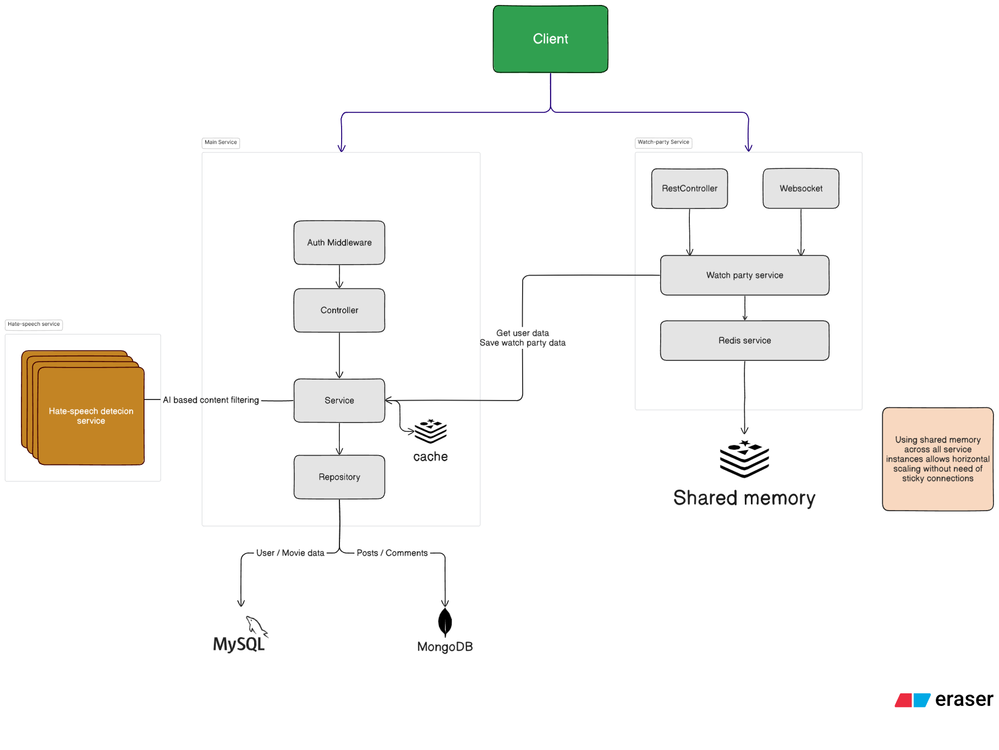
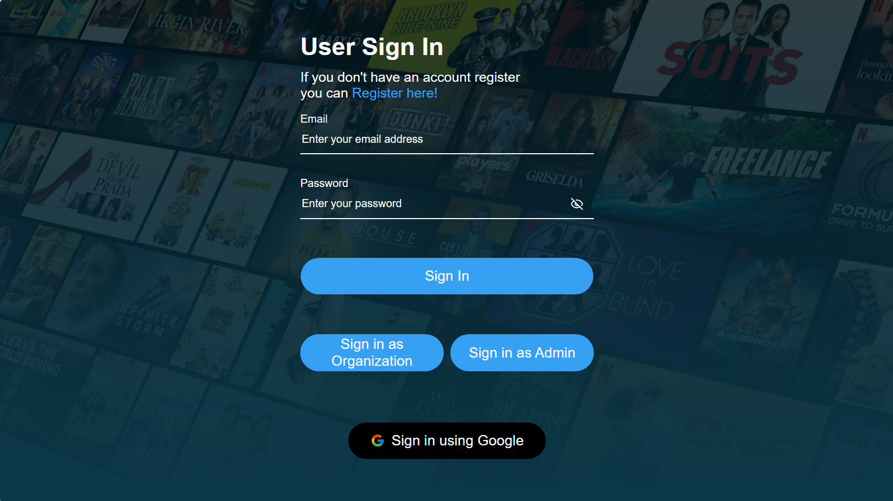
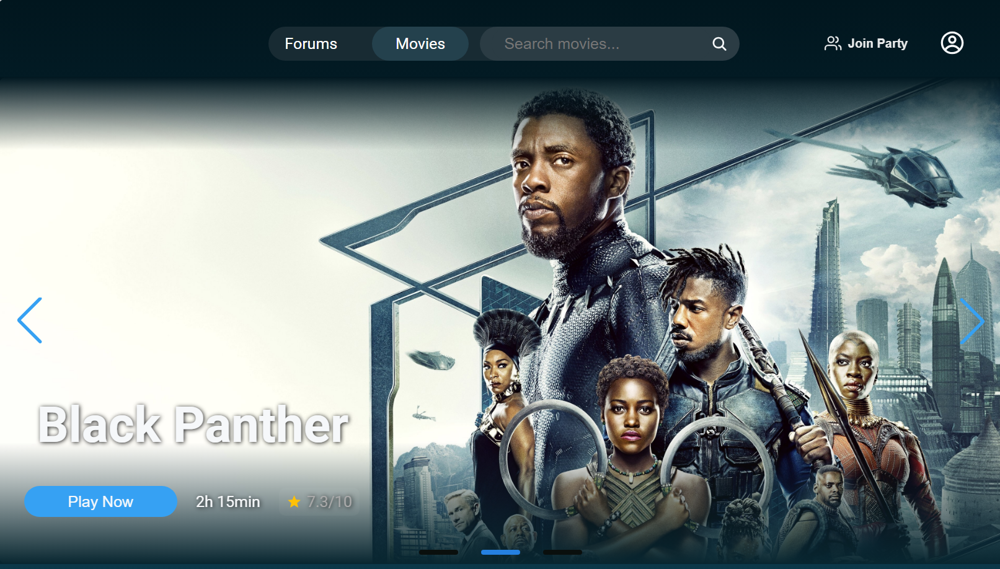
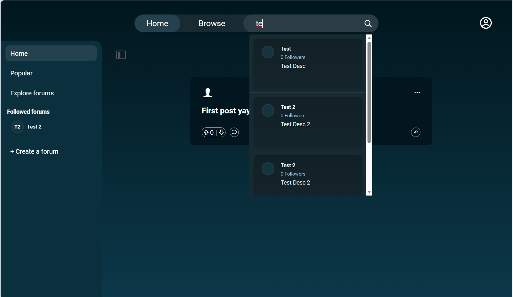
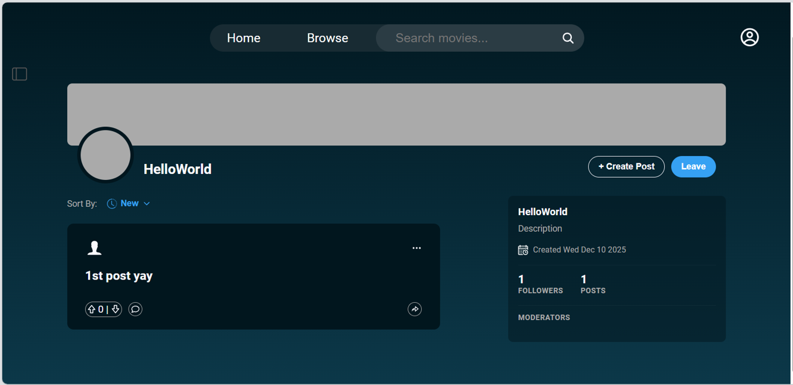
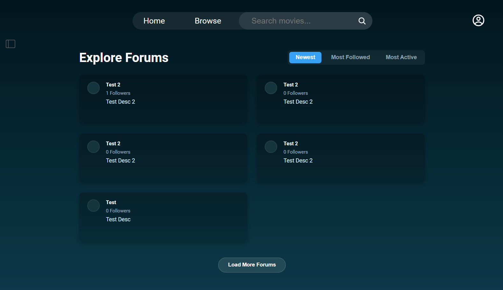
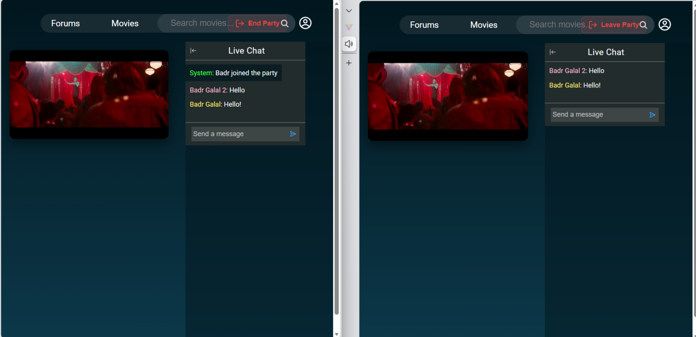

Cinemate is a modern full‑stack social platform for discovering and discussing movies, with realtime watch‑party support.


Table of contents
- [About](#about)
- [Highlights](#highlights)
- [Architecture Overview](#architecture-overview)
- [Running & Deployment](#running--deployment)
- [Testing & Quality](#testing--quality)
- [Screenshots & Diagrams](#screenshots--diagrams)
- [License](#license)

---

About
-----

Cinemate is a social application built to help movie fans discover, review, and watch movies together. The project demonstrates:

- A modern React frontend (Vite) with component-driven structure and client state using React Context, hooks and more.
- A Spring Boot backend for core APIs with separate watch‑party and hate-speech detector microservices for realtime features.
- A realtime syncing mechanism for watch parties using STOMP over WebSocket and Redis pub/sub in the watch‑party service.


Highlights
----------

- Realtime watch‑party with position sync and STOMP/WebSocket transport
- Microservice approach for realtime concerns
- Docker-first deployment with optional per-module development workflows
- CI through GitHub Actions and project tracking in Jira

---

Architecture overview
---------------------

High-level architecture 



1) Frontend (`frontend/`)

- Tech: React, Vite, JavaScript/JSX, CSS modules/plain CSS
- Structure: `src/components`, `src/pages`, `src/hooks`, `src/context`.
- Responsibilities:
    - Routes, pages, and components. 
    - Communicates with backend via REST JSON and connects to watch‑party service via STOMP over WebSocket.

2) Backend (`backend/`)

- Tech: Spring Boot (Java), controllers, services, DTOs
- Responsibilities:
	- Authentication and authorization (JWT or session-based stubs)
	- REST APIs for domains: users, forums, posts, moderation
	- Coordination between frontend and microservices (if needed)

3) Watch‑party microservice (`watch-party/`)

- Tech: Spring Boot, Redis, WebSocket STOMP
- Responsibilities:
	- Maintain ephemeral party state in Redis (TTL, members list)
	- Publish/subscribe party events using Redis and broadcast to WebSocket subscribers
	- Handle join/leave flows and party lifecycle

4) Hate‑speech / Content‑moderation microservice (`hate-api/`)

- Tech: Python & FastAPI that accepts text content and returns moderation verdicts.
- Responsibilities:
	- Scan posts and comments for abusive/hateful content.
	- Provide an API used by the backend block content or surface warnings to moderators.

5) Databases
- Primary (relational): MySQL — structured entities (users, movies, auth, transactional data)
- Secondary (document): MongoDB — unstructured or semi-structured data (forums, posts, comments)

6) External APIs & Providers:
	- Movie streaming provider: Wistia (embedded player)
	- Email verification: SendGrid (Twilio SendGrid)
	- Social login: Google OAuth


Deployment topology
- Containers behind a reverse proxy (Nginx) or simple load balancer.
- Redis is required for watch‑party microservice.
- Backend and watch‑party should be deployed where they can reach Redis and each other with low latency.

---


Design choices
--------------

After conducting research on scalability, performance trade-offs, and real-world case studies, the project adopts a hybrid database architecture to leverage the strengths of both relational and non-relational database systems. This approach preserves ACID guarantees for mission‑critical data while providing flexibility for dynamic user-generated content.

Main Database — MySQL
:
- Purpose: single source of truth for structured and mission‑critical data such as users, authentication credentials, and movie metadata.
- Rationale:
	- Strong ACID guarantees
	- Well-suited to entities with fixed schemas and relational constraints
	- Mature tooling for backups, migrations and transactional operations

Schema diagram: .png)

Secondary Database — MongoDB
:
- Purpose: store dynamic, user-generated content like forum posts, comments, and discussion threads.
- Rationale:
	- Document model maps naturally to posts/comments
	- Flexible schema for evolving content attributes
	- Horizontal scalability for high write/read volumes

Document structure & ERD: .png)

Although MongoDB is schemaless, the implementation follows a semi-structured convention for consistency.

Running & deployment
--------------------

**Docker (recommended)**

- The project is Docker-friendly and can be run with Docker Compose.

**Running modules individually (development)**

- Frontend (Dev server)

```bash
cd frontend
npm install
npm run dev
```

- Backend (Spring Boot)

```bash
cd backend
./mvnw spring-boot:run
# or on Windows: mvnw.cmd spring-boot:run
```

- Watch‑party

```bash
cd watch-party
./mvnw spring-boot:run
```

Environment variables
^^^^^^^^^^^^^^^^^^^^^

See `frontend/.env` examples and `backend/src/main/resources/application.properties` for keys consumed by the apps. Typical values:

```
# frontend/.env
VITE_API_BASE_URL=http://localhost:8080
VITE_API_WATCH_PARTY_BASE_URL=http://localhost:8081

# watch-party / backend
SPRING_REDIS_HOST=localhost
SPRING_REDIS_PORT=6379
```

Testing & quality
-----------------

- Comprehensive unit testing for backend and microservices using JUnit and Spring Boot testing framework.
- Achieved >60% code coverage, ensuring reasonable confidence in core business logic and service reliability.


Screenshots & diagrams
----------------------
#### UI screenshots - These are only snippets of the app

- User Login 




- Movies Homepage




- Posts Feed & Searching




- Forums & Posts




- Explore Forums




- Watch‑party host + guest view 



License
-----------------

Copyright © 2026 Cinemate Team. All rights reserved.

This repository is for educational and portfolio demonstration purposes only.
No part of this project may be copied, modified, redistributed, or used
without explicit written permission from the authors.

---

Media Disclaimer
----------------

Cinemate does not host, upload, or distribute any copyrighted movies or media files.

All movie posters, images, metadata, and trailers are used strictly for:
- Educational purposes
- Academic demonstration
- Portfolio showcase

Trailer content is embedded from authorized third-party providers.
No full-length movies are stored or streamed by this application.

All trademarks, movie titles, images, and related media are the property
of their respective copyright owners.
