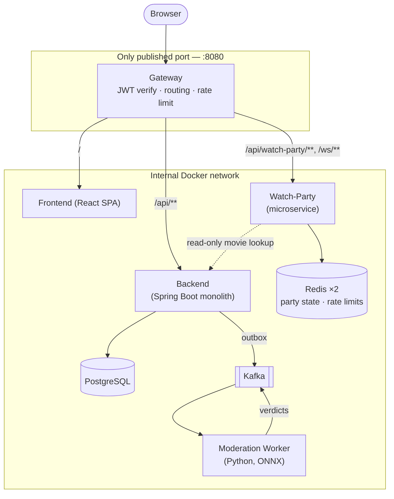
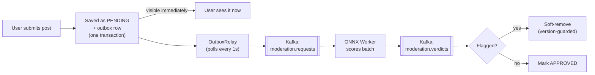
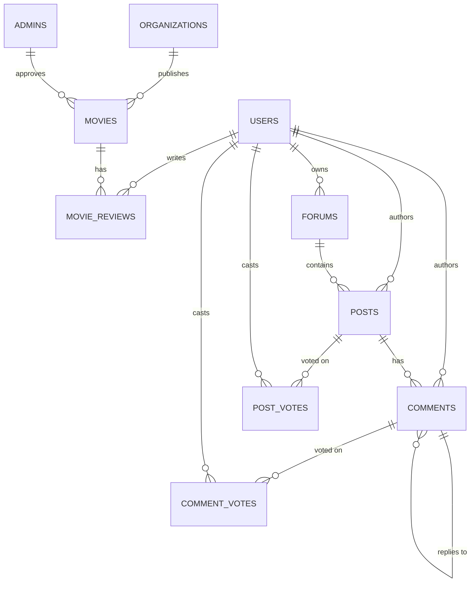

# Cinemate

**A social platform for movies** — discovery and reviews, Reddit-style forums, real-time
synchronized watch parties, and AI content moderation — built to explore how the pieces of a
production system actually fit together: a gateway that centralizes auth for every service
behind it, a moderation pipeline that never blocks a write, and a data layer that survived a
full polyglot-to-consolidated migration without losing a single correctness guarantee.

It's a portfolio-grade system. The goal wasn't to ship features fast — it was to
make the kind of architectural trade-offs a production team has to make, and be able to explain
every one of them.

---

## Why it's technically interesting
- **The data layer was consolidated, not just built.** Cinemate used to run MySQL *and* MongoDB
  *and* a caching Redis. It now runs on one PostgreSQL database — and the hardest part of that
  migration (making the moderation outbox commit atomically with its content) got *simpler*, not
  harder, because removing a cross-store boundary removes an entire class of distributed-systems
  bugs.
- **Content is never held hostage by a model.** Posts and comments save and appear instantly; a
transactional outbox guarantees the moderation request for that exact text will reach a Kafka
worker even if the process crashes right after the write. A reconciliation sweep guarantees
nothing gets stuck `PENDING` forever if a verdict is ever lost.
- **The backend never parses a JWT.** Every request is authenticated once, at the gateway edge,
  and forwarded as a trusted header. Every internal service — including a Spring service written
  independently, watch-party — just reads `X-User-Id` and trusts it, because the network topology
  makes that trust well-founded, not blind.


Read [`docs/architecture.md`](docs/architecture.md) for the full reasoning behind each of these.

---

## Key features

| | |
|---|---|
|  **Gateway-centralized auth** | One published port. RS256 access tokens verified at the edge (public key only, zero DB lookups), opaque refresh tokens rotated in Postgres, trusted-header propagation to every internal service. |
|  **Async content moderation** | Optimistic publish + transactional outbox → Kafka → ONNX worker fleet → idempotent verdict application. A reconciliation sweep closes the durability gap for lost verdicts. |
|  **Real-time watch parties** | A self-owning microservice — shared Redis state means any instance can serve any party, so it scales horizontally with no sticky sessions. |
|  **Reddit-style forums** | Forums → posts → threaded comments → votes, with trigger-maintained counters that structurally can't drift from the rows they count. |
|  **Consolidated, correctness-first schema** | One PostgreSQL database, UUIDv7 for non-enumerable social IDs, soft-delete with recursive-CTE cascades, generated columns for derived scores. |
|  **Measured, not guessed** | Real p50/p95/p99 latency numbers for the moderation pipeline and the post-write path — see [`docs/performance.md`](docs/performance.md). |

---

## Architecture

The browser only ever talks to the **gateway** — the single published port. Everything else is
internal to the Docker network.


```mermaid
flowchart TB
    Browser(["Browser"])

    subgraph Edge["Only published port — :8080"]
        Gateway["Gateway<br/>JWT verify · routing · rate limit"]
    end

    subgraph Internal["Internal Docker network"]
        Frontend["Frontend (React SPA)"]
        Backend["Backend<br/>(Spring Boot monolith)"]
        WatchParty["Watch-Party<br/>(microservice)"]
        Worker["Moderation Worker<br/>(Python, ONNX)"]
        Postgres[("PostgreSQL")]
        Kafka[["Kafka"]]
        Redis[("Redis ×2<br/>party state · rate limits")]
    end

    Browser --> Gateway
    Gateway -->|"/"| Frontend
    Gateway -->|"/api/**"| Backend
    Gateway -->|"/api/watch-party/**, /ws/**"| WatchParty
    Backend --> Postgres
    Backend -->|outbox| Kafka
    Kafka --> Worker
    Worker -->|verdicts| Kafka
    WatchParty --> Redis
    WatchParty -.->|"read-only movie lookup"| Backend
```

### Moderation pipeline at a glance


```mermaid
flowchart LR
    A["User submits post"] --> B["Saved as PENDING<br/>+ outbox row<br/>(one transaction)"]
    B -->|"visible immediately"| C["User sees it now"]
    B --> D["OutboxRelay<br/>(polls every 1s)"]
    D --> E[["Kafka:<br/>moderation.requests"]]
    E --> F["ONNX Worker<br/>scores batch"]
    F --> G[["Kafka:<br/>moderation.verdicts"]]
    G --> H{Flagged?}
    H -->|yes| I["Soft-remove<br/>(version-guarded)"]
    H -->|no| J["Mark APPROVED"]
```

Full request-flow and pipeline deep dives: [`docs/architecture.md`](docs/architecture.md),
[`docs/moderation.md`](docs/moderation.md).

---

## Database

One PostgreSQL database. Identity/catalog data uses compact `BIGINT` ids; social content uses
non-enumerable, time-ordered `UUIDv7` ids — a deliberate split at the point where the workload's
shape actually changes. Full rationale and every table: [`docs/database.md`](docs/database.md).


```mermaid
erDiagram
    USERS ||--o{ MOVIE_REVIEWS : writes
    USERS ||--o{ FORUMS : owns
    USERS ||--o{ POSTS : authors
    USERS ||--o{ COMMENTS : authors
    ORGANIZATIONS ||--o{ MOVIES : publishes
    ADMINS ||--o{ MOVIES : approves
    MOVIES ||--o{ MOVIE_REVIEWS : has
    FORUMS ||--o{ POSTS : contains
    POSTS ||--o{ COMMENTS : has
    COMMENTS ||--o{ COMMENTS : "replies to"
    POSTS ||--o{ POST_VOTES : "voted on"
    COMMENTS ||--o{ COMMENT_VOTES : "voted on"
    USERS ||--o{ POST_VOTES : casts
    USERS ||--o{ COMMENT_VOTES : casts
```

---

## Tech stack

| Layer | Technology |
|---|---|
| Backend / microservices | Java 21, Spring Boot 4.1, Spring Security, Spring Cloud Gateway (all three JVM modules on a converged stack) |
| Frontend | React + Vite, served as a static SPA via nginx |
| Database | PostgreSQL 16 (JPA/Hibernate + Flyway) — single store for all application data |
| Realtime | Redis 7 (watch-party state) + WebSocket/STOMP |
| Messaging | Kafka 3.9 (KRaft, no ZooKeeper) — moderation pipeline |
| ML inference | ONNX Runtime + tokenizers (quantized transformer, Python worker) |
| Auth | RS256 JWT access tokens + opaque Postgres-backed refresh tokens, Google OAuth2 |
| Email | SendGrid |
| Deployment | Docker Compose |

---

## Repository structure

```
Cinemate/
├── backend/            Spring Boot monolith — auth, users, movies, forums/posts/comments/votes,
│                        feed, admin/org workflows, moderation producer + verdict consumer
├── gateway/             Spring Cloud Gateway — the single entry point
├── frontend/            React + Vite SPA
├── watch-party/         Self-owning watch-party microservice (REST + WebSocket/STOMP + Redis)
├── Content-moderator/    Python Kafka worker — ONNX toxicity scoring
├── docs/                 Architecture, database, gateway, auth, moderation, deployment docs
├── bench/                Performance-measurement harness (see docs/performance.md)
└── compose.yaml          Full-stack Docker Compose definition
```

---

## Documentation

| Doc | Use for |
|---|---|
| [`docs/architecture.md`](docs/architecture.md) | System architecture, design principles, service responsibilities, trade-offs |
| [`docs/database.md`](docs/database.md) | Schema design rationale, ID strategy, full ER diagram |
| [`docs/gateway.md`](docs/gateway.md) | Gateway routing, auth matrix, rate limiting |
| [`docs/auth.md`](docs/auth.md) | Access/refresh token model |
| [`docs/moderation.md`](docs/moderation.md) | The async moderation pipeline — deep dive + study guide |
| [`docs/deployment.md`](docs/deployment.md) | Environment variables, Docker Compose, local/production running |
| [`docs/tech-debt.md`](docs/tech-debt.md) | Known limitations and open trade-offs |
| [`docs/performance.md`](docs/performance.md) | Measured latency/throughput numbers |

---

## Running the project

```bash
# 1. Copy the env templates and fill in secrets
cp .env.example .env
cp backend/.env.example backend/.env.prod

# 2. Build and start the full stack
docker compose up --build
```

Open the app at **http://localhost:8080** (the gateway). See
[`docs/deployment.md`](docs/deployment.md) for every environment variable and how to obtain
external API credentials (Google OAuth2, SendGrid).

### Testing

- Backend unit tests (mocked): `cd backend && ./mvnw test`
- Integration tests use **Testcontainers** (a real `postgres:16` container + Flyway), so a
  reachable Docker daemon is required.
- Gateway and watch-party each have their own CI job alongside the backend's.

---

## Media disclaimer

Cinemate does **not** host or distribute copyrighted movies. All movie posters, metadata, and
trailers are used strictly for educational, academic, and portfolio demonstration purposes. All
media content belongs to its respective copyright owners.
