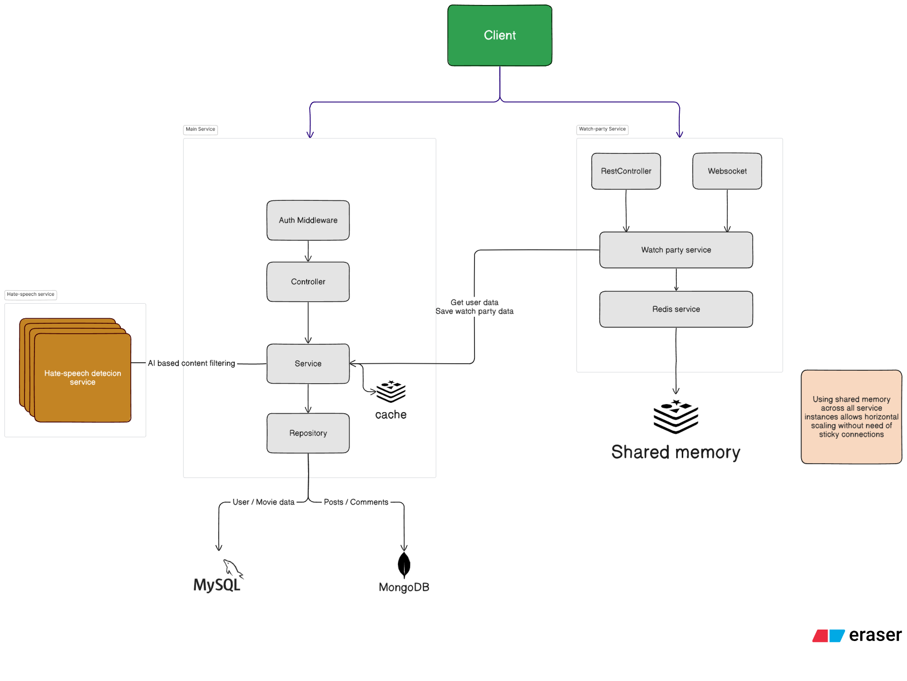

# Cinemate

**Cinemate** is a full-stack social platform for discovering movies, writing reviews, participating in community discussions, and hosting real-time watch parties with friends.

The system is designed using a hybrid monolith + microservices architecture and a polyglot persistence data model to handle both transactional and high-volume social content efficiently.

---

## Features

* Movie discovery and reviews
* Reddit-style forums (posts, comments, discussions)
* Real-time watch party with live chat
* JWT authentication and authorization
* Content moderation service (AI-based)
* Redis-backed real-time party state management
* Dockerized multi-service deployment

---

## Tech Stack

| Layer            | Technology                     |
| ---------------- | ------------------------------ |
| Backend          | Spring Boot                    |
| Frontend         | React                          |
| Relational DB    | MySQL                          |
| Document DB      | MongoDB                        |
| Cache / Realtime | Redis                          |
| Microservice     | FastAPI (Python)               |
| Realtime         | WebSockets                     |
| Deployment       | Docker / Docker Compose        |
| External APIs    | Wistia, SendGrid, Google OAuth |

---

## Architecture Overview



### Services

#### 1. Main Backend Service

**Spring Boot**

* Authentication & authorization (JWT)
* REST APIs (users, movies, forums, posts, moderation)
* Business logic and core application services
* Integration with microservices and external APIs

#### 2. Watch Party Microservice

**Spring Boot + Redis + WebSockets**

* Maintains party state in Redis
* Pub/Sub messaging for party events
* WebSocket broadcasting for real-time updates
* Handles join/leave and party lifecycle

#### 3. Content Moderation Microservice

**Python FastAPI**

* AI-based text moderation
* Scans posts/comments for abusive or hateful content
* Returns moderation verdicts to backend

#### 4. Databases

* **MySQL** → Structured transactional data (users, auth, movies)
* **MongoDB** → User-generated content (posts, comments, forums)

---

## Design Decisions
### Shared Redis State for Watch-Party Service (Horizontal Scaling)

The watch-party service uses **Redis as a shared in-memory state store** instead of storing session or party state inside individual Spring Boot service instances.

**Rationale:**

* Watch parties require shared state (members, playback time, chat events, party status).
* If state were stored inside each service instance, users connected to different instances would not see the same party state.
* By storing all party/session state in **shared Redis memory**, any service instance can handle any user request.
* This allows the watch-party microservice to be **horizontally scaled behind a load balancer without sticky sessions**, since all instances read/write from the same shared state.

**Result:**

* Stateless service instances
* No sticky sessions required
* Easier horizontal scaling
* Better fault tolerance (instance can die without losing party state)
* Consistent party state across all service instances

### Polyglot Persistence

The system uses **MySQL + MongoDB** to balance consistency and scalability.

| Database | Used For                              | Reason                                 |
| -------- | ------------------------------------- | -------------------------------------- |
| MySQL    | Users, authentication, movie metadata | ACID, relational constraints           |
| MongoDB  | Posts, comments, forums               | Flexible schema, high write throughput |

Schema diagram:
.png)

Document model:
.png)

---

## Running the Project

### Docker (Recommended)

```bash
docker compose up --build
```

Make sure to configure environment variables and API keys before running.

---

## Testing & Quality

* Unit and integration testing using **JUnit + Spring Boot Test**
* Service and API testing performed using **API testing tools and load testing**
* ~60%+ backend code coverage
* Integration testing with containerized databases

---

## Project Highlights

This project demonstrates:

* Hybrid **monolith + microservices** architecture
* **WebSockets** for real-time communication
* **Redis Pub/Sub** for distributed state management
* **Polyglot persistence** (MySQL + MongoDB)
* **JWT authentication & authorization**
* **Dockerized multi-service deployment with multi-stage builds**
* External API integration
* Content moderation microservice

---

## Media Disclaimer

Cinemate does **not** host or distribute copyrighted movies.

All movie posters, metadata, and trailers are used strictly for:

* Educational purposes
* Academic demonstration
* Portfolio showcase

All media content belongs to their respective copyright owners.

---
