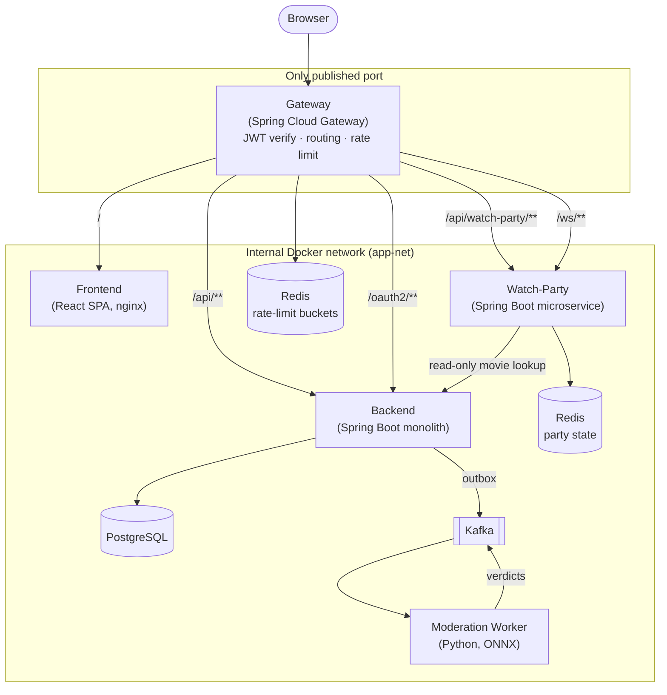
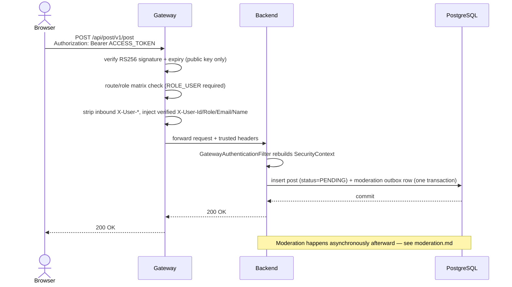

# Architecture

Cinemate is a **hybrid monolith + microservices** system: one Spring Boot monolith for the
bulk of the domain, two purpose-extracted microservices (gateway, watch-party) where a real
architectural property demanded it, and a standalone Python worker for ML inference. This
document explains the shape of the system, why each boundary exists, and the trade-offs
behind the decisions that aren't obvious from the code alone.

---

## 1. System overview

The browser only ever talks to the **gateway** — the single published port. Everything else
is internal to the Docker network and unreachable from the host.

Nothing besides the gateway (and Postgres's dev-only host port) is reachable from outside the
Docker network.

---

## 2. Design principles

### Single entry point (the gateway)
The gateway is the only service with a published host port. It verifies tokens at the edge
and forwards a trusted identity to the internal backend, which has no host port and therefore
cannot receive forged identity headers. One origin also means no CORS anywhere and a
`SameSite=Lax` refresh cookie. See [`gateway.md`](gateway.md).

### Asynchronous content moderation
Moderation sits off the request's critical path. Content is saved as `PENDING` and visible
immediately; a transactional outbox relays a moderation request to Kafka, an ONNX worker fleet
scores it, and a verdict either approves or retroactively removes the content. A reconciliation
sweep re-checks anything whose verdict never arrives. See [`moderation.md`](moderation.md).

### One consolidated datastore
All application data lives in a single PostgreSQL database. The original design split identity
data (MySQL) from social content (MongoDB) plus a response-cache Redis; consolidating removed
an entire cross-store consistency problem (the moderation outbox used to need a *second*
transaction manager to commit atomically with Mongo-backed content — now it's one ordinary
transaction). See [`database.md`](database.md).

### Watch-party as a genuinely self-owning microservice
Watch-party isn't a thin proxy in front of shared state — it owns the entire session domain
(lifecycle, membership, host authority, status) in its own Redis instance, with no backend
control-plane copy and no shared database row. Its only external dependency is a read-only,
lazy call to the backend's movie API for `movieUrl` at party-create time — not a startup
dependency, and not on the hot path of any realtime message.

**Why this is a genuine boundary and not premature extraction:** watch-party's traffic
pattern (many small, low-latency WebSocket messages, bursty per active party) is different
enough from the backend's request/response REST traffic that it benefits from scaling and
deploying independently, without dragging the whole monolith's request volume through the
same JVM. The trade-off — two services instead of one, a second CI pipeline, a second
Dockerfile — is accepted deliberately; see [`tech-debt.md`](tech-debt.md) (ARC-02) for where
that trade-off is still being evaluated at this project's current scale.

---

## 3. Service responsibility map

| Service | Responsibility | Data | Reached via |
|---|---|---|---|
| `gateway/` | Single entry point: serves the SPA, proxies `/api` + `/ws`, verifies RS256 access tokens, enforces the route/role matrix, injects trusted `X-User-*` headers, rate-limits (Bucket4j) | none (stateless verification; rate-limit counters in Redis) | Published host port `:8080` |
| `backend/` | Auth issuance, users/movies/reviews, forums/posts/comments/votes, feed, admin/org workflows, moderation producer + verdict consumer + reconciliation sweep | PostgreSQL | Internal only, via gateway `/api/**` |
| `frontend/` | React + Vite SPA | none | Internal only, via gateway `/` |
| `watch-party/` | Owns the entire watch-party session domain: lifecycle, membership, host authority, realtime sync + chat over WebSocket/STOMP | Redis (durable, AOF) | Internal only, via gateway `/api/watch-party/**` (REST) + `/ws/**` (WebSocket) |
| `Content-moderator/` | Kafka consumer that scores queued text with a quantized ONNX transformer and produces verdicts | none (stateless; reads Kafka, writes Kafka) | Internal only, via Kafka |

---

## 4. Request flow — a typical authenticated write

The identity check happens exactly once, at the edge. The backend never sees a raw JWT and
never talks to anything for authentication — it trusts the headers because the only way to
reach it is through the gateway.

---

## 5. Trade-offs considered

- **Hybrid, not full microservices.** Splitting every bounded context (users, movies, forums,
  votes, feed) into its own service would add operational cost — one Docker image, one CI
  pipeline, one set of runbooks per service — with no corresponding benefit at this project's
  scale, since those contexts share the same traffic pattern and the same data (Postgres joins
  across them are cheap and correct). Only watch-party and the gateway earned their own
  service boundary, each for a concrete, different reason (§2).
- **Gateway-centralized auth over per-service auth.** Before the gateway, every service
  validated its own JWT and configured its own CORS. Centralizing verification means adding a
  new internal service never means re-implementing auth — it just trusts `X-User-*` behind the
  gateway.
- **Consolidated persistence over polyglot "best tool for the job."** Polyglot persistence
  (MySQL + MongoDB + Redis) optimized each store for its workload shape, but it meant the
  moderation outbox needed a second transaction manager and a Mongo replica set just to commit
  atomically with content — real distributed-systems complexity for a project at this scale.
  One Postgres database removes that cross-store boundary entirely (see [`database.md`](database.md)),
  at the cost of losing per-store specialization Cinemate wasn't actually using yet (no
  document-flexible schema requirement, no separate scaling profile for social content).
- **At-least-once + idempotency over exactly-once messaging.** The moderation pipeline
  deliberately doesn't chase Kafka's exactly-once semantics — it accepts duplicate delivery and
  makes every effect idempotent instead. Simpler to build and reason about, and just as correct
  for this workload. See [`moderation.md`](moderation.md) §5.3.

---

## 6. Related documents
- [`gateway.md`](gateway.md) — routing, auth matrix, rate limiting, trusted-header contract.
- [`auth.md`](auth.md) — access/refresh token model.
- [`moderation.md`](moderation.md) — the async moderation pipeline.
- [`database.md`](database.md) — schema and persistence design.
- [`deployment.md`](deployment.md) — environment variables and running the stack.
- [`tech-debt.md`](tech-debt.md) — known limitations and open trade-offs.
