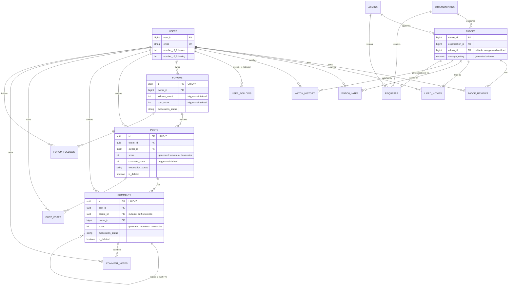

# Database — Schema Design & Rationale

Cinemate runs on a **single PostgreSQL 16 database** (JPA/Hibernate + Flyway). This wasn't the
starting point — the original design split data across MySQL (identity/catalog) and MongoDB
(social content), plus a response-cache Redis. That polyglot store was consolidated into one
Postgres database; this document is the schema as it exists today, plus the reasoning behind
its shape. Flyway migrations (`backend/src/main/resources/db/migration/`) are the literal
source of truth — this is the rationale layer on top.

---

## 1. Two decisions that shape the whole schema

### D1 — ID strategy: hybrid

| Domain | ID type | Why |
|---|---|---|
| Identity/catalog: `users`, `admins`, `organizations`, `movies`, and their join tables | **`BIGINT` identity** | Compact, low volume, and already wired into the gateway/JWT `X-User-Id` contract — changing it would ripple for zero benefit. |
| Social content: `forums`, `posts`, `comments`, `post_votes`, `comment_votes`, `forum_follows` | **`UUID` v7** | Timestamp-prefixed (index-friendly, no B-tree hot-spotting), **non-enumerable** (can't scrape `/posts/1,2,3…`), generatable app-side without a DB round-trip, and shardable later with no central sequence. |

**Trade-off:** two ID types is marginally more cognitive load than one type everywhere, but the
all-`BIGINT` alternative makes every social row enumerable and reintroduces a central sequence
as a future sharding obstacle. The hybrid draws the line exactly where the workload's shape
changes. (Postgres 16 lacks a native `uuidv7()`, so IDs are generated app-side via a small
`UuidV7` helper.)

### D2 — Delete strategy: soft-delete only where it's load-bearing

| Data | Strategy | Reason |
|---|---|---|
| `forums`, `posts`, `comments` | **Soft delete** (`is_deleted`, `deleted_at`) | Moderatable and restorable — the verdict consumer does version-guarded removal, and admins can restore. Soft-delete is genuinely load-bearing here. |
| `post_votes`, `comment_votes` | **Hard delete / upsert** | A vote is never moderated or restored. "Change vote" = flip `vote_type`; "remove vote" = delete row. |
| `forum_follows`, `liked_movies`, `watch_later`, `user_follows` | **Hard delete** | Pure toggles — "unfollow" means the relationship is gone. A `UNIQUE` constraint makes re-adding a plain insert. |
| `watch_history` | **Hard delete** | An append-only log; removing an item is a row delete. |

**Cascade mechanics:** soft-deleted rows can't rely on FK `ON DELETE CASCADE` (the row stays),
so a subtree soft-delete is a recursive-CTE `UPDATE` that flips `is_deleted` on the whole
subtree in one statement. Physical cleanup (a scheduled purge) does a real `DELETE`, and FK
`ON DELETE CASCADE` removes the children (comments, votes) automatically at that point.

---

## 2. Entity-relationship overview

Three tables deliberately sit **outside** this graph, with no object-level FK relationships:
`refresh_tokens` and `oauth_exchange_codes` (opaque auth credentials, looked up by hash/code,
not joined to anything) and `moderation_outbox` (a polymorphic `content_type` + `content_id`
reference — see [`moderation.md`](moderation.md) — deliberately decoupled so the outbox
mechanism doesn't need a foreign key per content type).

Note: `forums`/`posts`/`comments`/`post_votes`/`comment_votes`/`forum_follows` use **real
Postgres foreign keys**, but their JPA entities hold plain FK-column values (`ownerId`,
`forumId`, …) rather than `@ManyToOne` object graphs — access checks join manually
(`comments → posts → forums`) rather than walking a Hibernate object graph. That keeps the
social-content entities cheap to load (no accidental N+1 through a relationship you didn't
mean to fetch).

---

## 3. Cross-cutting conventions

- **Timestamps:** social/token tables use `TIMESTAMPTZ` (maps to `Instant`) throughout — a
  genuine correctness fix over the old mix of zone-less and zoned timestamps across stores.
- **Enums** (`Genre`, `State`, `Gender`, `ModerationStatus`, vote type): `VARCHAR` +
  `CHECK (col IN (...))`. Unlike a native Postgres `ENUM`, this evolves without `ALTER TYPE`.
- **Soft-delete mixin:** a JPA `@MappedSuperclass` supplying `is_deleted BOOLEAN DEFAULT false`
  + `deleted_at TIMESTAMPTZ NULL`, applied only to the three tables that keep soft-delete.
- **Derived counters — three mechanisms, chosen per shape** (this kills the "hand-maintained
  counter drift" bug class):
  - `score` on posts/comments → `GENERATED ALWAYS AS (upvote_count - downvote_count) STORED`.
  - Parent/child aggregates with a non-polymorphic source (`posts.comment_count`,
    `forums.post_count`/`follower_count`) → an `AFTER` trigger on the child table.
  - `movies.average_rating` → a generated column over `rating_sum`/`rating_count`.

  **Trade-off accepted deliberately:** triggers are "invisible" logic, but they make the
  counters *impossible* to drift (atomic with the row change) — correctness as a structural
  property, not a discipline every write path has to remember.
- **Votes are two typed tables** (`post_votes`, `comment_votes`), not one polymorphic table.
  This is the sharpest "challenge the old design" call in the whole migration: a polymorphic
  `(targetType, targetId)` table can't hold a real foreign key. Two typed tables give real FK
  integrity, `ON DELETE CASCADE` (deleting a post deletes its votes — no cascade code), a
  natural composite PK that enforces one-vote-per-user, and simple non-polymorphic count
  triggers. The cost is two (symmetric) service paths instead of one, mediated by a shared
  generic vote handler so business logic isn't duplicated.
- **Schema delivery:** Flyway (`V1__baseline.sql`, …) owns every DDL change; Hibernate runs
  `ddl-auto=validate` and never alters the schema itself.

---

## 4. The moderation outbox

`moderation_outbox` is the biggest simplification the consolidation delivered. In the old
design, committing a content row and its "please moderate this" note atomically required a
second Mongo transaction manager and a single-node replica-set requirement. In one Postgres
database, that's just an ordinary `@Transactional` method — the content insert and the outbox
insert are in the same transaction by default. See [`moderation.md`](moderation.md) for the
full pipeline this table feeds.

---

## 5. Implementation notes (where the schema deviates from a "clean" design)

A few pragmatic calls made during implementation, kept here so they don't look like oversights:

- Relational join tables (`liked_movies`, `watch_later`, `watch_history`, `user_follows`) keep
  denormalized fields (e.g. `movie_name`) and relational-style timestamps rather than switching
  to `TIMESTAMPTZ` everywhere — converting them added churn for no correctness gain, since they
  were never the zone-bug source.
- `movies.average_rating` and `users.number_of_followers` stay app-maintained (they already
  were, and are transactional now that there's one database) — triggers were reserved for the
  counters that Mongo used to maintain in application code, where drift was the actual bug.
- Forum search stays substring `ILIKE` (matching how the old Mongo-backed search actually
  behaved) rather than adding a `tsvector`/GIN column; full-text search is a documented
  follow-up, not a day-one requirement.
- No materialized view for the explore feed. The partial indexes on `posts`/`forums` keep the
  explore queries cheap; a materialized view (or `pg_cron` refresh) is the fallback if
  `EXPLAIN ANALYZE` ever shows real cost — deliberately not built ahead of that evidence.

---

## 6. Related documents
- [`architecture.md`](architecture.md) — how the database fits into the wider system.
- [`moderation.md`](moderation.md) — the transactional-outbox pipeline that writes to
  `moderation_outbox`.
- `backend/src/main/resources/db/migration/` — the actual, authoritative Flyway migrations.
