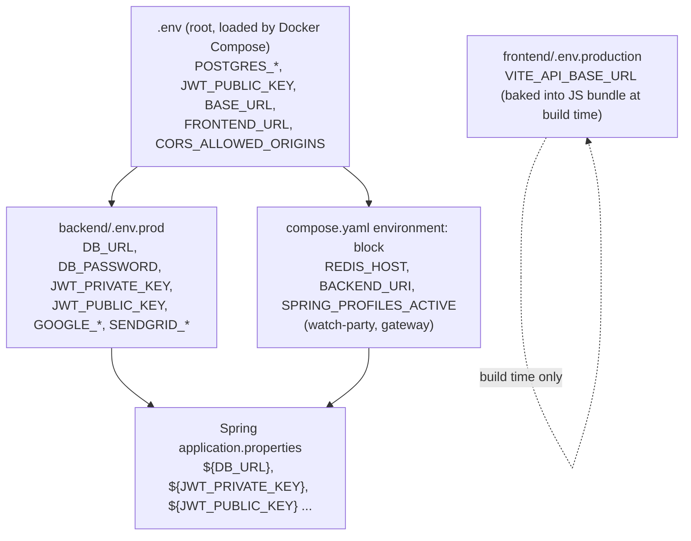

# Deployment — Environment Variables & Running the Stack

This document covers every environment variable Cinemate uses, how to obtain each external
credential, and how to run the stack locally or in production via Docker Compose.

---

## Quick Start (Local Dev)

```bash
# 1. Copy the root template and fill in secrets
cp .env.example .env

# 2. Copy the backend template
cp backend/.env.example backend/.env.prod

# 3. The frontend already has .env.development with localhost defaults — no changes needed.

# 4. Start everything
docker compose up --build
```

Open the app at **http://localhost:8080** — the gateway is the only published port.

> [!IMPORTANT]
> **Never commit `.env` or `backend/.env.prod`** — they are listed in `.gitignore`. Only
> `.env.example` files are safe to commit.

---

## Variables by service

### Root Compose (`.env`)

Read by `compose.yaml` via `${VAR}` substitution and injected into the relevant containers.
(See `.env.example` for the full annotated template.)

| Variable | Required | Default | Description |
|---|---|---|---|
| `POSTGRES_PASSWORD` | ✅ | — | PostgreSQL password (also becomes `DB_PASSWORD` for the backend) |
| `POSTGRES_DB` | ✅ | `Cinemate` | PostgreSQL database name |
| `POSTGRES_USER` | ✅ | `cinemate` | PostgreSQL username |
| `JWT_PUBLIC_KEY` | ✅ | — | RS256 public key — the gateway verifies access tokens with it |
| `BASE_URL` | ✅ | `http://localhost:8080` | The gateway origin (single entry point) |
| `FRONTEND_URL` | ✅ | `http://localhost:8080` | Post-login redirect target (the gateway origin) |
| `CORS_ALLOWED_ORIGINS` | ✅ | `http://localhost:8080` | Origin allowed to open the `/ws` WebSocket (watch-party) |
| `TOXIC_THRESHOLD` / `SEVERE_TOXIC_THRESHOLD` | ❌ | `0.5` | Moderation-worker toxicity thresholds |
| `HF_MODEL_REPO` / `HF_MODEL_REVISION` | ❌ | pinned | ONNX model baked into the worker image at build time |

### Backend (`backend/.env.prod`)

Loaded via `env_file: ./backend/.env.prod` in `compose.yaml`.

#### Database

| Variable | Required | Description |
|---|---|---|
| `DB_URL` | ✅ | JDBC URL for PostgreSQL (e.g. `jdbc:postgresql://postgres:5432/Cinemate`) |
| `DB_USERNAME` | ✅ | PostgreSQL username (matches `POSTGRES_USER`) |
| `DB_PASSWORD` | ✅ | PostgreSQL password (must match `POSTGRES_PASSWORD`) |
| `JPA_SHOW_SQL` | ❌ | Log every SQL query — disable in prod (default `false`) |

> Schema is owned by **Flyway** migrations (`ddl-auto=validate`, fixed). There is no
> `JPA_DDL_AUTO` knob or `MONGODB_URI` — the app runs on a single PostgreSQL database.

#### JWT (RS256 keypair)

Access tokens are **RS256** — signed with a private key, verified with the public key. There
is no shared HMAC secret. The public key is also given to the gateway so it can verify tokens
at the edge.

| Variable | Required | Description |
|---|---|---|
| `JWT_PRIVATE_KEY` | ✅ | Base64 (DER/PKCS#8) or PEM private key. Signs access tokens; **backend only**. |
| `JWT_PUBLIC_KEY` | ✅ | Base64 (DER/X.509) or PEM public key. Verifies tokens; used by **backend + gateway**. |
| `JWT_ACCESS_TOKEN_EXP_MS` | ❌ | Access-token lifetime (default `900000` = 15 min). |
| `JWT_REFRESH_TOKEN_EXP_MS` | ❌ | Refresh-token lifetime (default `604800000` = 7 days). |

**Generate a keypair (single-line base64, env-friendly):**
```bash
openssl genpkey -algorithm RSA -pkeyopt rsa_keygen_bits:2048 -out priv.pem
openssl rsa -pubout -in priv.pem -out pub.pem
JWT_PRIVATE_KEY=$(grep -v '^-' priv.pem | tr -d '\n')
JWT_PUBLIC_KEY=$(grep -v '^-' pub.pem  | tr -d '\n')
```

- The **private** key signs access tokens and must stay only on the backend.
- The **public** key verifies tokens; it is given to both the backend and the gateway.
- Rotating the keypair invalidates all in-flight access tokens (≤15 min lifetime), so the
  blast radius is small — but refresh tokens (opaque, in Postgres) survive.

#### Google OAuth2

| Variable | Required | Description |
|---|---|---|
| `GOOGLE_CLIENT_ID` | ✅ | OAuth 2.0 Client ID from Google Cloud Console |
| `GOOGLE_CLIENT_SECRET` | ✅ | OAuth 2.0 Client Secret |
| `BASE_URL` | ✅ | The single externally-reachable origin — the **gateway** (e.g. `http://localhost:8080` or `https://cinemate.example.com`). Used to build the Google OAuth redirect URI. |
| `FRONTEND_URL` | ✅ | The gateway origin the backend redirects to after a Google login (same value as `BASE_URL`). |
| `CORS_ALLOWED_ORIGINS` | ✅ | The browser origin (the gateway). The backend no longer does CORS (single origin behind the gateway); this is consumed **only** by watch-party's WebSocket origin check. |

#### SendGrid

| Variable | Required | Description |
|---|---|---|
| `SENDGRID_API_KEY` | ✅ | SendGrid API key (begins with `SG.`) |
| `SENDGRID_FROM_EMAIL` | ✅ | Verified sender email address (must be verified in SendGrid) |

#### Internal services

| Variable | Required | Default | Description |
|---|---|---|---|
| `KAFKA_BOOTSTRAP_SERVERS` | ❌ | `kafka:9092` | Internal Kafka broker for the moderation pipeline (outbox → `moderation.requests`, verdicts ← `moderation.verdicts`). No auth — internal-only. |

The backend's only call *to* watch-party is a read-only movie lookup, made lazily and only
when a watch party is created — the backend has no other dependency on it, and there is no
internal API key or shared secret between the two services anymore (watch-party fully owns
its domain; see [`architecture.md`](architecture.md)).

### Watch-Party Microservice (set in `compose.yaml`)

These are passed directly in the `compose.yaml` `environment:` block, not via a `.env.prod` file.

| Variable | Value in Compose | Description |
|---|---|---|
| `SPRING_PROFILES_ACTIVE` | `prod` | Spring profile |
| `REDIS_HOST` | `redis` | Docker service name for Redis |
| `REDIS_PORT` | `6379` | Redis port |
| `CORS_ALLOWED_ORIGINS` | from root `.env` | Origins allowed to open the `/ws` WebSocket — same value the backend uses |
| `JWT_PUBLIC_KEY` | from root `.env` | Public half of the RS256 keypair — verifies the access token on the STOMP CONNECT frame |
| `BACKEND_URI` | `http://backend:8080` | Backend base URL for the read-only movie lookup at party-create time |

### Frontend (`frontend/.env.development` / `frontend/.env.production`)

> [!IMPORTANT]
> Vite environment variables are **baked into the static bundle at build time**. They are not
> runtime secrets — they will be visible in the compiled JS bundle. Do not put secrets here.

| Variable | Description |
|---|---|
| `VITE_API_BASE_URL` | Base URL of the backend REST API (no trailing slash) |
| `VITE_API_WATCH_PARTY_BASE_URL` | Base URL of the watch-party WebSocket microservice |

For local dev, `.env.development` has `http://localhost:8080` and `http://localhost:8081` —
these work out of the box. For production, update `frontend/.env.production` with your real
domain before running `docker compose up --build`.

---

## How to get each API key

### 1. Google OAuth2 Client ID & Secret

Used for "Sign in with Google".

1. Go to [Google Cloud Console](https://console.cloud.google.com/) → **APIs & Services** → **Credentials**.
2. Click **Create Credentials** → **OAuth 2.0 Client ID**.
3. Choose **Application type: Web application**.
4. Set **Authorized redirect URIs**:
   - Local dev: `http://localhost:8080/login/oauth2/code/google`
   - Production: `https://api.yourbackenddomain.com/login/oauth2/code/google`
5. Click **Create**. Copy the **Client ID** and **Client Secret** into `.env` and
   `backend/.env.prod`.
6. Make sure `BASE_URL` (backend public URL) and `FRONTEND_URL` (frontend public URL) are also
   set so OAuth redirects land in the right place.

> [!TIP]
> Google OAuth requires the **redirect URI** registered in the console to exactly match what
> the backend sends: `${BASE_URL}/login/oauth2/code/google`.

### 2. SendGrid API Key

Used to send email verification codes and password reset emails.

1. Create a free account at [sendgrid.com](https://sendgrid.com/) (free tier: 100 emails/day).
2. **Settings** → **API Keys** → **Create API Key** → **Restricted Access** → **Mail Send: Full Access**.
3. Copy the key (starts with `SG.`) — **you can only see it once**.
4. **Settings** → **Sender Authentication** → **Single Sender Verification** → verify your
   sending address.

> [!NOTE]
> `SENDGRID_FROM_EMAIL` must be a **verified sender** in SendGrid or emails silently fail.

### 3. JWT Keypair (RS256)

Not an external service — generate it yourself (see the JWT section above for the exact
commands). The private key signs, the public key verifies; only the public key ever leaves
the backend (it's shared with the gateway).

### 4. PostgreSQL Password

Set `POSTGRES_PASSWORD` in the root `.env` to any strong value, and use the **same** value for
`DB_PASSWORD` in `backend/.env.prod`:
```bash
openssl rand -base64 24
```

### 5. Content-Moderation Model (no API key needed)

The `moderation-worker` service bakes the `minuva/MiniLMv2-toxic-jigsaw-lite` ONNX model
(pinned HuggingFace revision) into its image **at Docker image build time**. No account or API
key is required. Thresholds are configured via `TOXIC_THRESHOLD` / `SEVERE_TOXIC_THRESHOLD`
(default `0.5` each); either label crossing its threshold flags the content.

> [!NOTE]
> The first `docker compose up --build` downloads the model at build time and may take a few
> minutes. Subsequent runs reuse the cached image layer.

---

## Environment variable flow



---

## Running in production

Cinemate is deployed as a single Docker Compose stack — there's no Kubernetes manifest or
separate orchestration layer today (see [`tech-debt.md`](tech-debt.md) for what a larger
deployment would need, e.g. observability and CI coverage for `docker compose build`).

For a production-like deployment on a single host:

1. Set `BASE_URL` / `FRONTEND_URL` / `CORS_ALLOWED_ORIGINS` to your real public domain
   (`https://cinemate.example.com`), not `localhost`.
2. Update `frontend/.env.production` with the same domain before building.
3. Set `app.cookie.secure=true` (backend) once served over HTTPS, so the refresh cookie
   requires TLS.
4. Generate fresh JWT keys, Postgres password, and SendGrid/Google credentials — never reuse
   the local-dev values.
5. `docker compose up -d --build`. Only the gateway's `8080` needs to be reachable from the
   internet; put a reverse proxy / TLS terminator in front of it if you need HTTPS at the edge
   (Compose itself doesn't terminate TLS).
6. PostgreSQL's `5433` host-port mapping in `compose.yaml` is a **dev convenience** — drop it
   in a real production deployment so the database isn't reachable from the host network at all.

---

## Testing

- Backend unit tests (mocked, no containers): `cd backend && ./mvnw test`
- Integration tests use **Testcontainers** (a real `postgres:16` container + Flyway), so a
  reachable Docker daemon is required.
- Gateway and watch-party each have their own CI job (`.github/workflows/gateway-tests.yml`,
  `watch-party-tests.yml`) alongside `backend-tests.yml`.
