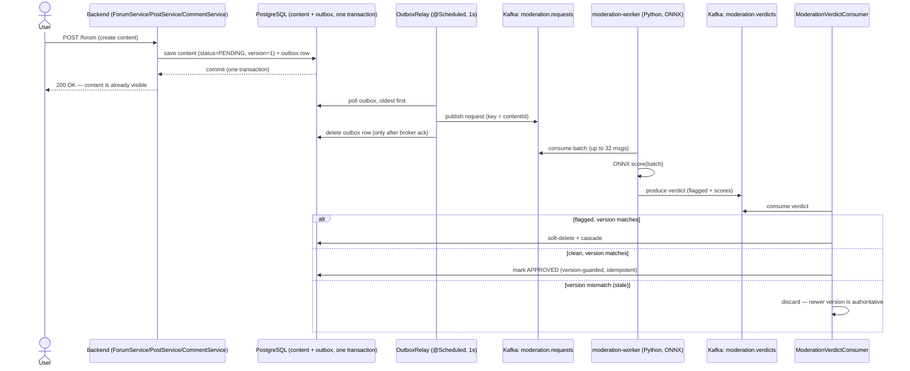

# Content Moderation Architecture — Study Guide

A deep walkthrough of how Cinemate moderates user text (posts, comments, forums):
what each piece does, how they fit together, and **why** each design decision was made.
Read it top-to-bottom once; after that the "Component reference" and "Failure modes"
sections are the ones you'll come back to.

The pipeline runs on **PostgreSQL** (`moderation_outbox` table) + **Kafka** — the content
row and its outbox entry commit in one ordinary Postgres transaction, no distributed
transaction manager required. See [`database.md`](database.md) for the schema.

---

## 1. The one-paragraph mental model

When a user creates content, we **save it immediately and show it** (`moderationStatus =
PENDING`) — we do *not* wait for a toxicity check. In the *same database transaction* we
also write a little "please moderate this" note into an **outbox** table. A background
**relay** ships those notes to **Kafka**. A fleet of **workers** reads them, runs an ONNX
toxicity model, and writes a **verdict** back to Kafka. The backend reads verdicts and, if
something was flagged, **removes it retroactively**. Nothing a user does ever blocks on the
model, and no note is ever lost even if the app crashes at the worst possible moment.

That's the whole thing. The rest of this document explains each italicized word.

---

## 2. Why it's built this way (the three big decisions)

Before the mechanics, understand the three choices that shape everything else.

### 2.1 Optimistic publish (not "hold until approved")
Content is **visible the instant it's saved**; a flagged verdict removes it a second or two
later. The alternative — hold content as `PENDING` and only show it once approved — makes
*every* post feel laggy and makes a moderation backlog a product outage.

- **Trade-off we accepted:** toxic content is briefly visible (seconds).
- **Why it's fine here:** this is how Reddit/YouTube-style platforms work; the removal is
  fast and automatic, and the nightly-cleanup instinct already lived in the old code.

### 2.2 Asynchronous, off the write path
The old system called a hate-speech HTTP API **synchronously** inside `addPost()` — every
write blocked 200–2000ms (10s timeout) on one single-threaded model. Adding backend
replicas didn't help: the model was the ceiling. Moving moderation onto a queue means the
write path is bounded by the database, and the model fleet scales independently.

### 2.3 Transactional outbox for crash-safety
The scary bug in any "save to DB, then send to a queue" design is the **dual-write
problem** (§5). We solve it by writing the content and the "moderate me" request into the
**same Postgres transaction**, then relaying to Kafka separately. Either both the content
and its moderation request exist, or neither does — never one without the other.

---

## 3. The end-to-end flow



**Two independent async hops:** backend → `moderation.requests` → worker, and worker →
`moderation.verdicts` → backend. The backend is both a **producer** (of requests, via the
relay) and a **consumer** (of verdicts). The worker is the mirror image.

---

## 4. Component reference (the "how")

Every path below is relative to the repo root.

### 4.1 Domain model — the moderation state on content
Files: [`moderation/Moderatable.java`](../backend/src/main/java/org/example/backend/moderation/Moderatable.java),
[`ModerationStatus.java`](../backend/src/main/java/org/example/backend/moderation/ModerationStatus.java),
[`ContentType.java`](../backend/src/main/java/org/example/backend/moderation/ContentType.java)

Every moderatable entity (`Post`, `Comment`, `Forum`) implements `Moderatable` and carries
two fields:

| Field | Purpose |
|---|---|
| `moderationStatus` | `PENDING` → `APPROVED` / `REMOVED`. Content is visible in **every** state; `REMOVED` also soft-deletes it. |
| `moderationVersion` | Starts at 1, **incremented on every edit**. Lets a late verdict for old text be discarded (§6). |

`Moderatable` exists so the verdict consumer can apply a verdict to any content type
generically without a `switch` on concrete types for the field access.

### 4.2 The outbox table
Files: [`ModerationOutboxEntry.java`](../backend/src/main/java/org/example/backend/moderation/ModerationOutboxEntry.java),
[`ModerationOutboxRepository.java`](../backend/src/main/java/org/example/backend/moderation/ModerationOutboxRepository.java)

A row in the `moderation_outbox` table is a durable "publish this to Kafka later"
instruction: `{ id, contentType, contentId, contentVersion, text (snapshot), createdAt }`.

- `id` is a monotonic `BIGINT IDENTITY`, so reading `findAllByOrderByIdAsc` replays
  entries in the order they were created (important for per-content edit order).
- `text` is a **snapshot** taken at write time. The worker never reads our database — it
  moderates exactly the text that was written, which matters when content is edited (§6).

### 4.3 Enqueue — writing the outbox row
File: [`ModerationOutboxService.java`](../backend/src/main/java/org/example/backend/moderation/ModerationOutboxService.java)

`enqueue(contentType, contentId, version, text)` just saves one outbox entry inside the
**same `@Transactional` method as the content save** — that's what makes the outbox
atomic. The caller owns the transaction; in one Postgres database this is just an
ordinary transactional method, no second transaction manager involved.

### 4.4 The services — optimistic publish
Files: [`post/PostService.java`](../backend/src/main/java/org/example/backend/post/PostService.java),
[`comment/CommentService.java`](../backend/src/main/java/org/example/backend/comment/CommentService.java),
[`forum/ForumService.java`](../backend/src/main/java/org/example/backend/forum/ForumService.java)

Each create/update follows the same shape (using `createForum` as the example):

```java
Forum forum = Forum.builder()...build();          // moderationStatus defaults to PENDING, version 1
Forum saved = forumRepository.save(forum);          // content — visible immediately
moderationOutboxService.enqueue(                    // outbox — same transaction
    ContentType.FORUM, saved.getId(),
    saved.getModerationVersion(),
    moderationText(saved.getName(), saved.getDescription()));
```

Key points:
- **No synchronous moderation, no blocking call.** The old blocking call is gone.
- **Title + content (or name + description) are moderated as one snapshot** joined by `\n` —
  one model pass covers both fields, and there's no ambiguity about which field a verdict
  refers to.
- **Edits** (`updatePost`, `updateForum`) bump `moderationVersion`, reset status to
  `PENDING`, and enqueue the new version — the edited text gets re-moderated.
- **`systemDeletePost` / `systemDeleteForum` / `systemDeleteComment`** are removal methods
  *without* an ownership check — they exist for the verdict consumer to remove flagged
  content (a user isn't "deleting" it; the system is).

### 4.5 The publisher: OutboxRelay
File: [`moderation/OutboxRelay.java`](../backend/src/main/java/org/example/backend/moderation/OutboxRelay.java)

This is the bridge from the durable outbox to Kafka. It runs on a timer:

```java
@Scheduled(fixedDelayString = "${moderation.outbox.relay-delay-ms:1000}")
public void relay() {
    List<ModerationOutboxEntry> batch = outboxRepository.findAllByOrderByIdAsc(PageRequest.of(0, batchSize));
    for (entry : batch) {
        String payload = objectMapper.writeValueAsString(ModerationRequestMessage.from(entry));
        kafkaTemplate.send(requestsTopic, entry.getContentId(), payload).get(timeout);  // BLOCK until ack
        outboxRepository.deleteById(entry.getId());                                      // delete AFTER ack
    }
}
```

Why each detail matters:

- **Poll oldest-first (`findAllByOrderByIdAsc`)** — preserves creation order, which combined
  with keying by `contentId` keeps a content item's edits in order.
- **Key the Kafka message by `contentId`** — Kafka guarantees ordering *within a partition*,
  and all messages with the same key go to the same partition. So two edits of the same post
  are delivered to the worker in order.
- **Blocking send + `.get()`** — we wait for the broker to acknowledge before deleting the
  outbox row. This is **delete-after-ack**: if the process dies after `send` but before
  `delete`, the row survives and is re-published next tick. That's what makes delivery
  **at-least-once** (§5).
- **Stop at the first failed send** — if Kafka is down, we stop and retry the whole batch
  next tick, preserving order rather than skipping ahead. Content creation is unaffected;
  requests just pile up in the outbox until the broker returns.
- **Unserializable rows are dropped**, not retried forever — they can never succeed.

> **Known limitation (MOD-03):** the relay is an unlocked `@Scheduled` poller, so it assumes a
> **single backend instance**. With multiple replicas, each would publish every row (duplicate
> requests). Idempotency (§5) keeps that *correct*, but it's wasteful — a leader lock
> (ShedLock) or `FOR UPDATE SKIP LOCKED` claim-before-publish is needed before scaling the
> backend horizontally. See [`tech-debt.md`](tech-debt.md).

### 4.6 The wire contracts
Files: [`ModerationRequestMessage.java`](../backend/src/main/java/org/example/backend/moderation/ModerationRequestMessage.java),
[`ModerationVerdictMessage.java`](../backend/src/main/java/org/example/backend/moderation/ModerationVerdictMessage.java)

JSON, keyed by `contentId`. Request (backend → worker):

```json
{ "v": 1, "contentType": "POST", "contentId": "0191…", "version": 3, "text": "…" }
```

Verdict (worker → backend):

```json
{ "v": 1, "contentType": "POST", "contentId": "0191…", "version": 3,
  "flagged": true, "scores": { "toxic": 0.98, "severe_toxic": 0.02 } }
```

- `version` is **echoed untouched** by the worker — the backend uses it to detect stale
  verdicts (§6).
- The verdict record uses **boxed types** (`Boolean`, `Long`) and `@JsonIgnoreProperties`, so a
  missing field deserializes to `null` and is rejected explicitly rather than silently
  defaulting (e.g. a missing `flagged` must not read as `false`).

### 4.7 Topic configuration
File: [`moderation/ModerationKafkaConfig.java`](../backend/src/main/java/org/example/backend/moderation/ModerationKafkaConfig.java)

Declares four topics as `NewTopic` beans; Spring's `KafkaAdmin` creates them at backend
startup (broker auto-create is **off** so partition counts stay deliberate):

| Topic | Partitions | Role |
|---|---|---|
| `moderation.requests` | 12 | work queue backend → workers |
| `moderation.verdicts` | 12 | results workers → backend |
| `moderation.requests.dlq` | 1 | poison messages (malformed requests, worker-side) |
| `moderation.verdicts.dlq` | 1 | verdicts that exhausted their retry budget (backend-side) |

**Partition count = maximum worker parallelism.** Consumers in a group can't exceed the
partition count, so 12 leaves room to scale workers without repartitioning. `replicas=1`
matches the single-broker dev setup; production would use RF=3 with `min.insync.replicas=2`.

### 4.8 The worker (publisher of verdicts, consumer of requests)
Files: [`Content-moderator/worker/worker.py`](../Content-moderator/worker/worker.py),
[`inference.py`](../Content-moderator/worker/inference.py)

This is a standalone Python service (not a web framework — a pure Kafka consumer/producer
loop). The main loop:

```python
while True:
    batch = consumer.consume(num_messages=MAX_BATCH, timeout=1s)   # natural micro-batch
    if len(batch) < MAX_BATCH:
        batch += consumer.consume(MAX_BATCH - len(batch), LINGER_MS/1000)  # top up briefly
    flush(consumer, producer, batch)
```

`flush()`:
1. Parse each message. **Malformed → produce to the DLQ** (don't crash the partition).
2. `inference.score([...texts])` — **one ONNX call for the whole batch**.
3. For each result: `flagged = toxic >= TOXIC_THRESHOLD or severe_toxic >= SEVERE_TOXIC_THRESHOLD`.
4. Produce each verdict, keyed by the same `contentId`.
5. `producer.flush()`; if any delivery failed, **raise** (die without committing → redelivery).
6. Only if all verdicts are durable: `consumer.commit()`.

Why these choices:
- **`enable.auto.commit=false` + commit-after-produce** — the offset only advances once
  verdicts are safely in Kafka. Crash mid-batch → the whole batch is redelivered
  (at-least-once).
- **Idempotent producer (`enable.idempotence=True`, implies `acks=all`)** — no silent loss or
  in-session duplication of a verdict.
- **Micro-batching** — `consume()` returns many messages at once; batching amortizes model
  overhead. `inference.py` sorts the batch by text length before padding ("length bucketing")
  so a short comment isn't padded out to a long outlier's length.
- **The threshold logic lives here**, driven by env vars — the backend just consumes `flagged`.

`inference.py` loads the ONNX session + tokenizer **once per process** and exposes exactly
one function, `score(texts) -> [{"toxic":…, "severe_toxic":…}]`. The model
(`minuva/MiniLMv2-toxic-jigsaw-lite`) is baked into the image at build time (see the worker
Dockerfile), so there's no network fetch at runtime.

### 4.9 The verdict consumer
File: [`moderation/ModerationVerdictConsumer.java`](../backend/src/main/java/org/example/backend/moderation/ModerationVerdictConsumer.java)

```java
@KafkaListener(topics = "${moderation.topics.verdicts}")
public void onVerdict(String payload) { … }
```

It parses/validates the verdict, resolves the `ContentType`, and dispatches:

- **Clean verdict** → one atomic, **version-guarded** update:
  ```
  UPDATE ... SET status = 'APPROVED'
  WHERE id = :id AND moderation_version = :version AND status = 'PENDING'
  ```
  If the content was edited since (version moved on), or already resolved, this matches
  nothing — a **no-op**. No read, no delete.
- **Flagged verdict** → look up by id; then:
  - content missing or already deleted → **no-op** (idempotent: a redelivered verdict does
    nothing).
  - `moderationVersion != verdict.version` → **stale, ignore** (the text was edited; the newer
    request's verdict is authoritative).
  - otherwise → set `status = REMOVED`, then call the type's `systemDelete…` to soft-delete +
    cascade.

**`ack-mode=record`** (in `application.properties`) means the Kafka offset is committed
*after* `onVerdict` returns — so a crash mid-apply redelivers the verdict rather than losing
it. This is why every branch above must be **idempotent**.

**Retry + DLQ.** The branches above are the *expected* failures (all no-ops); an
*unexpected* one — a repository throwing on a datastore blip, say — used to be swallowed by
Spring Kafka's default error handler: a few silent retries, then the offset commits anyway and
the verdict is gone with no trace. `ModerationKafkaConfig` wires the listener to its own
`moderationVerdictListenerContainerFactory` plus a `DefaultErrorHandler`:
`FixedBackOff(1000ms, 3 retries)`, then a `DeadLetterPublishingRecoverer` that republishes the
record — key and value untouched — to `moderation.verdicts.dlq` and *then* commits the offset.
A stuck verdict no longer wedges the partition or vanishes; it lands somewhere a human can see
and replay it. There's no automatic consumer of the DLQ (parity with the requests-side DLQ,
which is likewise inspected manually) — draining it is an operational task, not a code path.

### 4.10 Configuration reference
File: [`application.properties`](../backend/src/main/resources/application.properties)

```properties
spring.kafka.bootstrap-servers=${KAFKA_BOOTSTRAP_SERVERS:localhost:9092}
spring.kafka.producer.acks=all                       # relay: no acked message lost
spring.kafka.producer.properties.enable.idempotence=true
spring.kafka.consumer.group-id=backend-moderation
spring.kafka.consumer.auto-offset-reset=earliest     # process backlog on fresh group
spring.kafka.consumer.enable-auto-commit=false
spring.kafka.listener.ack-mode=record                # commit after each verdict handled

moderation.topics.requests=moderation.requests
moderation.topics.verdicts=moderation.verdicts
moderation.topics.dlq=moderation.requests.dlq
moderation.topics.verdicts-dlq=moderation.verdicts.dlq
moderation.topics.partitions=12
moderation.outbox.batch-size=100
moderation.outbox.relay-delay-ms=1000
```

Worker env (defaults in `compose.yaml`): `KAFKA_BOOTSTRAP_SERVERS`, `MAX_BATCH=32`,
`LINGER_MS=15`, `TOXIC_THRESHOLD=0.5`, `SEVERE_TOXIC_THRESHOLD=0.5`.

### 4.11 The reconciliation sweep
Files: [`moderation/ModerationReconciliationSweep.java`](../backend/src/main/java/org/example/backend/moderation/ModerationReconciliationSweep.java),
[`moderation/ModerationReconciliationService.java`](../backend/src/main/java/org/example/backend/moderation/ModerationReconciliationService.java)

Closes the outbox's missing half (§5.4): the outbox guarantees a request is *published*,
but nothing previously re-checked content whose verdict never came back. Every
moderatable table (`posts`, `comments`, `forums`) has a `moderation_requested_at` column —
distinct from `created_at`, which never changes — set when the current moderation request
was made (on create, and again on every edit that bumps `moderationVersion`).

```java
@Scheduled(fixedDelayString = "${moderation.sweep.interval-ms:60000}", ...)
public void sweep() {
    Instant cutoff = Instant.now().minusSeconds(stuckAfterMinutes * 60);
    reconciliationService.sweepPendingPosts(cutoff, batchSize);
    reconciliationService.sweepPendingComments(cutoff, batchSize);
    reconciliationService.sweepPendingForums(cutoff, batchSize);
}
```

For each content type, one `@Transactional` sweep (in `ModerationReconciliationService`,
a separate bean so the scheduled call goes through the Spring proxy):

1. Finds `PENDING` rows whose `moderation_requested_at` is older than the cutoff (a partial
   index on `(moderation_requested_at) WHERE moderation_status = 'PENDING'` keeps this cheap
   as approved/removed content comes to dominate each table).
2. Bulk-updates `moderation_requested_at = now()` for the batch **before** enqueuing — so a
   row that's re-swept isn't re-swept again next tick before the fresh request has had a
   chance to be answered.
3. Calls `ModerationOutboxService.enqueue(...)` for each row, for the **same**
   `moderationVersion` — it doesn't touch the content, so a genuinely in-flight verdict (just
   slow) is still authoritative when it eventually arrives.

A duplicate request (the original verdict shows up late, or after the sweep already
re-enqueued) is harmless — the pipeline is idempotent by design (§5.3). Config:
`moderation.sweep.stuck-after-minutes` (default 10), `moderation.sweep.batch-size` (100),
`moderation.sweep.interval-ms` (60000).

---

## 5. Delivery semantics & the transactional outbox (the core "why")

This section is the conceptual heart — the part worth truly understanding.

### 5.1 The dual-write problem
Naively, moderation would be: `save content to the DB; then send request to Kafka`. But
these are two separate systems with no shared transaction. If the process crashes *between*
them, you get a post that exists but was never moderated — **silent, permanent**. Retrying
the Kafka send first and saving after just inverts the failure (a moderation request for a
post that doesn't exist).

There is no way to make "write to DB" and "write to Kafka" atomic directly. This is a
fundamental distributed-systems problem, not a Cinemate quirk.

### 5.2 How the outbox solves it
Split the operation into two steps, each individually safe:

1. **Content + outbox row** committed in **one Postgres transaction.** Atomic by
   construction — both or neither. No Kafka involved yet.
2. **A separate relay** reads the outbox and publishes to Kafka, deleting each row **only
   after** the broker acknowledges.

Now trace the crash points:
- Crash during step 1 → transaction rolls back → no content, no outbox row. Clean.
- Crash after step 1, before relay → content exists, outbox row exists → relay publishes it
  next tick. Nothing lost.
- Crash after `send` but before `deleteById` → row survives → relay re-publishes → a
  **duplicate** request. Harmless (§5.3).

The database is the single source of truth; Kafka is fed *from* it, never written beside it.

### 5.3 At-least-once + idempotency (not exactly-once)
Every hop here is **at-least-once**: the relay can double-publish (crash before delete), and
the worker can double-produce (crash before commit). We deliberately do **not** chase
Kafka's exactly-once semantics (EOS) — it's heavy machinery. Instead we make **duplicates
harmless** by making every effect **idempotent**:

- Applying "flagged → remove" twice = the second one sees it's already deleted and no-ops.
- Applying "clean → APPROVED" twice = the version-guarded update matches nothing the second
  time.
- Keying everything by `contentId` keeps a content item's messages ordered and colocated.

> **The lesson:** knowing *when you don't need* exactly-once is more valuable than being able
> to configure it. Idempotent operations + at-least-once delivery is simpler and just as
> correct here.

### 5.4 Where durability is strong vs. soft
- **Strong (ingress):** once a content write commits, its moderation request *will* reach
  Kafka (outbox + delete-after-ack). Broker downtime only delays it.
- **Covered (egress):** if a *verdict* is lost — e.g. the verdict consumer throws past its
  retry budget (routed to `moderation.verdicts.dlq`), or a worker bug — the reconciliation
  sweep (§4.11) re-enqueues content that has sat `PENDING` past a threshold, so a dropped
  verdict is a delay (until the next sweep tick), not a silent permanent gap.

---

## 6. Ordering & stale verdicts (the version guard)

Content can be **edited while its moderation request is in flight**. Example:

1. User posts "helo wrld" → version 1 → request v1 sent.
2. User edits to "hello world" → version 2, status back to `PENDING` → request v2 sent.
3. Verdict for **v1** arrives (maybe it flagged a typo-obscured slur) → but the current text
   is v2.

Applying the v1 verdict would moderate text that no longer exists. The guard: the verdict
carries the `version` it was computed for; the consumer only acts if
`content.moderationVersion == verdict.version`. The v1 verdict is discarded as **stale**; the
v2 verdict is authoritative.

Keying Kafka messages by `contentId` means v1 and v2 requests (and their verdicts) stay in
one partition, processed in order — but the version guard is the real correctness
mechanism; ordering is just a helpful assist.

---

## 7. Failure modes — what happens when X breaks

| Failure | Behavior | Data safe? |
|---|---|---|
| Kafka broker down | Relay can't publish → outbox rows accumulate → retried each tick. Content creation unaffected (it never touches Kafka). | ✅ requests wait durably |
| Backend crashes after content save, before relay | Outbox row survives the restart → published next tick. | ✅ |
| Backend crashes after Kafka `send`, before outbox delete | Row survives → re-published → duplicate request → idempotent verdict. | ✅ |
| Worker crashes mid-batch (before commit) | Offset not committed → batch redelivered → possibly duplicate verdicts → idempotent apply. | ✅ |
| Worker gets a malformed request | Routed to `moderation.requests.dlq`; worker keeps running. | ✅ (isolated) |
| Verdict consumer throws (e.g. datastore blip) | Retried (bounded backoff), then republished to `moderation.verdicts.dlq` with offset committed — no infinite redelivery, no silent drop. | ✅ recoverable (manual replay from DLQ) |
| Verdict simply never arrives (bug/loss) | Reconciliation sweep (§4.11) re-enqueues it once `moderation_requested_at` ages past the threshold — a delayed re-check, not a permanent gap. | ✅ bounded delay |
| Two backend replicas | Both relays publish every row → duplicate requests → idempotent but wasteful (MOD-03). | ✅ correct, wasteful |

---

## 8. Dependencies

**Backend (Java):**
- `spring-kafka` — `KafkaTemplate` (relay producer), `@KafkaListener` (verdict consumer),
  `KafkaAdmin` (topic creation).
- `spring-boot-starter-data-jpa` + Flyway + the PostgreSQL driver — entities,
  repositories, and the outbox table that shares the content transaction.
- Jackson (via Boot) — request/verdict JSON.

**Worker (Python):** [`Content-moderator/worker/requirements.txt`](../Content-moderator/worker/requirements.txt)
- `confluent-kafka` — consumer/producer.
- `onnxruntime` + `tokenizers` + `numpy` — model inference.

**Infrastructure** ([`compose.yaml`](../compose.yaml)):
- **Kafka** `apache/kafka:3.9.1` in **KRaft** mode (no ZooKeeper) — single-node, internal-only.
- **PostgreSQL** `postgres:16` — the outbox row commits in the same ordinary transaction
  as its content; no replica set or special configuration required.
- **moderation-worker** — built from `Content-moderator/`, the model baked in at build time.

The backend deliberately does **not** `depends_on: kafka` — optimistic publish means the app
must boot and serve writes even when the moderation pipeline is down (the outbox just fills
up and drains later).

---

## 9. Glossary

- **Transactional outbox** — pattern where a message-to-be-sent is written in the same DB
  transaction as the state change, then relayed to the broker separately. Solves the
  dual-write problem.
- **Dual-write problem** — the impossibility of atomically writing to two systems (DB + queue)
  without a shared transaction.
- **At-least-once** — every message is delivered one or more times (never zero); duplicates
  are possible.
- **Idempotent** — applying the same operation twice has the same effect as applying it once.
- **Consumer group** — a set of consumers sharing a subscription; Kafka splits the topic's
  partitions among them, so each message is processed by exactly one member.
- **Offset** — a consumer's bookmark in a partition. Committing an offset says "I've durably
  processed up to here."
- **Partition** — an ordered, independently-consumable shard of a topic. Ordering is
  guaranteed only *within* a partition; the message key decides the partition.
- **KRaft** — Kafka's built-in consensus (Raft) that replaces ZooKeeper for metadata.
- **Micro-batching** — accumulating several messages and processing them in one shot
  (here, one ONNX call per batch) to amortize per-item overhead.
- **Length bucketing** — sorting a batch by text length before padding so short inputs aren't
  padded to a long outlier's length, cutting wasted compute.

---

## 10. Self-check questions

If you can answer these, you understand the system:

1. Why can't we just `save(); kafkaTemplate.send();` and skip the outbox entirely?
2. The relay crashes right after Kafka acknowledges a send but before it deletes the outbox
   row. What happens on restart, and why is it safe?
3. A user edits a post twice in quick succession. Three verdicts arrive out of order. Which
   one wins, and what mechanism enforces that?
4. Why does the worker commit its Kafka offset *after* producing verdicts rather than before?
5. How does the outbox row commit atomically with its content, and why does that need
   no special database configuration?
6. Where is the durability guarantee strong, and where is it soft? What single component closes
   the soft gap?
7. Why did we choose at-least-once + idempotency over Kafka's exactly-once semantics?
8. What breaks if you run two backend replicas today, and why is it a performance problem
   rather than a correctness one?

---

## 11. Related documents
- [`tech-debt.md`](tech-debt.md) — remaining moderation work items (MOD-03) and the wider backlog.
- [`Content-moderator/README.md`](../Content-moderator/README.md) — the worker service in isolation.
- [`deployment.md`](deployment.md) — env vars and deployment.
- [`database.md`](database.md) — schema, including the `moderation_outbox` table.
